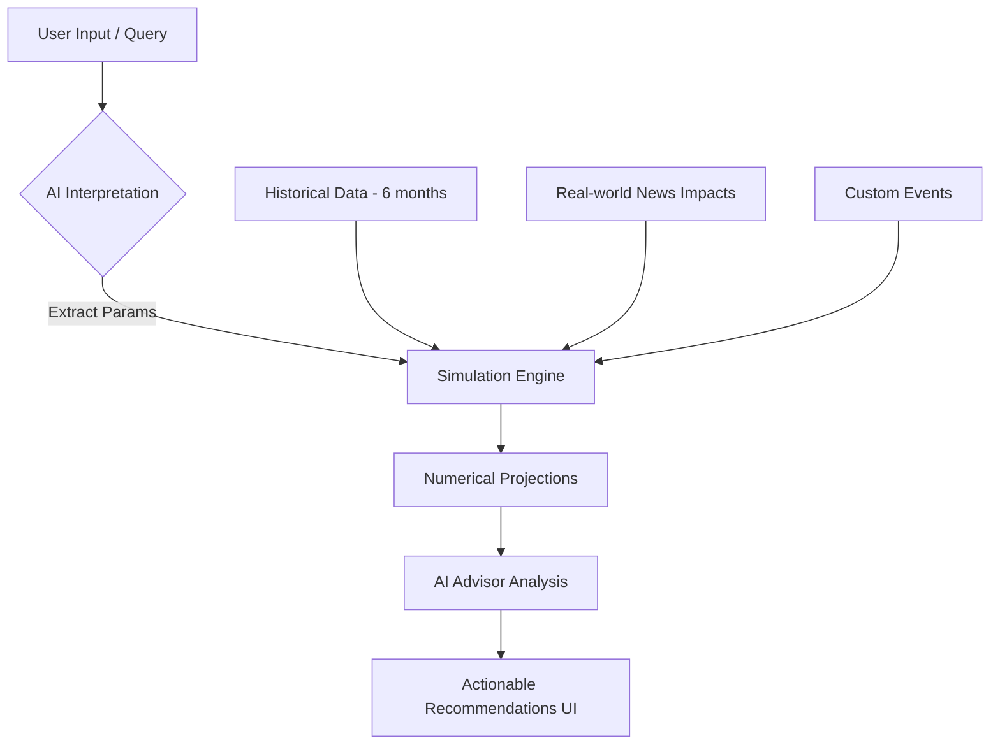

# LoggerBoggers: Project Comprehensive Guide

LoggerBoggers is a premium, AI-driven personal finance management platform. It goes beyond simple tracking by providing deep visual insights, historical trend analysis, and a sophisticated simulation engine that helps users model future financial scenarios.

---

## 1. Core Features & User Experience

### 📊 Dashboard & Overview
The landing experience provides a high-level view of the user's financial health, integrating income, account balances, and categorized spending.

### 🔍 Insights Engine
The Insights page is the analytical heart of the application, featuring multiple specialized views:
- **Graph View**: A dynamic `React Flow` visualization that maps the flow of capital from **Income Sources** (e.g., Tech Salary) to **Accounts** (Checking/Savings) and finally to **Expense Categories** (Rent, Food, etc.).
- **Analysis View**: Interactive stacked bar charts (via `Recharts`) that break down monthly spending by category, allowing for rapid identification of cost drivers.
- **Calendar View**: A date-centric interface where users can click on specific days to see a detailed transaction pop-up, standardizing how individual expenses are reviewed.
- **Trends & Forecasts**: Line charts that overlay actual historical spending against AI-predicted forecasts, highlighting deviations from normal patterns.
- **Subscriptions**: A dedicated view for tracking recurring payments, identifying "zombie" subscriptions, and managing monthly commitments.

### 🧪 Studio (Simulation Engine)
The Studio allows users to "stress test" their finances against hypothetical scenarios:
- **Scenario Interpretation**: Users can type natural language queries like *"I'm moving to London next month"* or *"I'm taking a 3-month sabbatical"*.
- **AI Parameter Extraction**: The system uses GPT-4o-mini to translate these queries into numerical impacts (e.g., +20% Rent, -100% Income).
- **News Integration**: Real-time (or mocked) financial news is pulled into the simulation to account for external factors like inflation spikes or industry-specific salary growth.
- **Actionable Advice**: After running a simulation, an AI advisor provides specific, tailored recommendations on how to prepare for the predicted outcome.

### 🕰️ Time Machine
A unique feature that allows users to "rewind" their financial data to any point in the past, visualizing their category breakdown and net worth at that specific moment.

---

## 2. Data Systems & Schema

The project uses a hybrid data approach, leveraging **Supabase (PostgreSQL)** for persistence and a sophisticated **Mock Data Engine** for development and fallback.

### Data Schema (Supabase)
| Table | Description | Key Fields |
| :--- | :--- | :--- |
| `transactions` | Individual spending records. | `date`, `amount`, `category`, `merchant`, `user_id` |
| `income` | Sources of revenue. | `date`, `amount`, `source_name`, `user_id` |
| `user_plaid_connections` | Plaid integration status. | `user_id`, `is_connected`, `access_token` |
| `user_profiles` | User-specific settings. | `user_id`, `preferences`, `onboarding_complete` |

### Mock Data Logic (`src/lib/mock-data.ts`)
The system includes a realistic generator that creates:
- **Monthly fixed bills** (Rent, Internet).
- **Habitual spending** (Groceries, Coffee) with randomized frequency and multipliers for holiday seasons.
- **Anomalies** (One-off large purchases) for testing risk detection logic.

---

## 3. The AI & Simulation Pipeline

The simulation pipeline is a multi-step process designed for accuracy and relevance:

1.  **Context Loading**: Fetches the last 6 months of real transaction data to establish a baseline.
2.  **Scenario Mapping**: Translates user intent into `% change` variables for income and expenses.
3.  **Engine Execution**: Runs a deterministic projection over a 12-month horizon, applying compounding news impacts and manual event overrides.
4.  **Final Synthesis**: Passes the raw numbers back to the AI to generate a human-readable summary of risks and opportunities.

---

## 4. Technical Architecture

### Frontend Stack
- **Framework**: `Next.js 15+` (App Router) for high-performance server-side rendering and routing.
- **Styling**: `Tailwind CSS` with a custom high-end design system (dark mode first, glassmorphism).
- **State Management**: `Zustand` for lightweight, decoupled state across the complex UI views.
- **Visualizations**: `Recharts` (charts), `React Flow` (nodal maps), and `Framer Motion` (micro-animations).

### Backend & API
- **API Routes**: Next.js Node.js runtime (or Edge) for processing simulations and data fetching.
- **External Integrations**:
    - **OpenAI**: Powering scenario interpretation and the advisor.
    - **Plaid**: Securely connecting to real-world bank accounts.
    - **Supabase**: Managed PostgreSQL and Auth.

---

## 5. Summary of Overall Workflow
When a user opens LoggerBoggers, the **Zustand stores** initialize the UI state. As they navigate to **Insights**, the system aggregates raw data on the fly to render high-density visualizations. If they move to the **Studio**, the **AI Pipeline** kicks in, merging their historical reality with hypothetical futures to provide a roadmap for their financial life.
